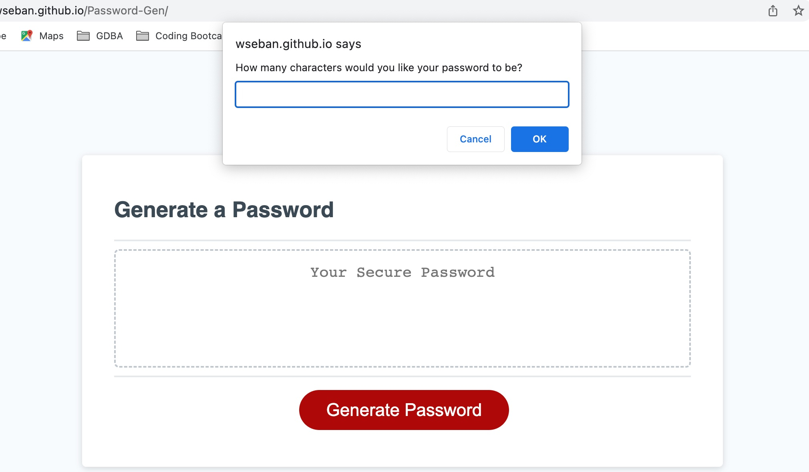
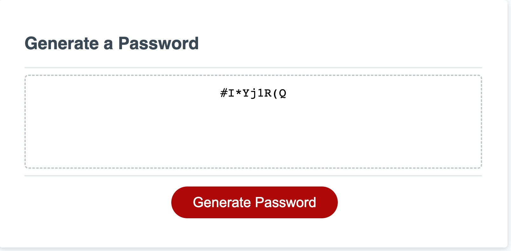

# Password Generator

## Site Picture

Deployed Link
https://wseban.github.io/Password-Gen/

## Usage
Upon hitting the "Generate Password" button on the webpage, the user is given a series of prompts...



When the user has gone through and given their criteria, a random password is produced...
 


## Technologies Used
- JavaScript - Allows developer to make static webpages dynamic and interactive.  For this exercise it was used to produce a randomized password within the criteria that the user gave to the program.
- Git - Git is what I used to work on my personal computer and pushing my work to GitHub.
- GitHub - A cloud based repository that holds my saved code reserved for resetting my personal computer deployment.

## Description

The purpose of this project was to utilize our skills with JavaScript to take the given button, and allow the user to interact with this webpage.  Our object was for the user to receive back a password that fits the parameter given to the password generator by them.  This project furthered my ability to psuedocode and logically think through what was happening, as well as, troubleshoot and debug my code.  

## Installation

NA

## Lessons Learned
The most effective lessons learned for me are visible through the below "Code Snippet".
1. Learning how to effectively code randomizing an array using Math.floor and understanding what it did for Math.random.  
2. Upon nearly completing the project I was still getting one random integer but I knew it was running my loop the correct amount of times.  I learned that adding that integer to the password creating in the previous loop would give me my desired outcome.  I believe this took me viewing different scope levels and logically talking out what was happening from the code.

## Code Snippets
JavaScript
```javaScript
else if (confirmUpper === true && confirmSpecial === true && confirmLower === false && confirmNumeric ===false){
    //console.log(combineUpperSpecial)-;
    function shuffleUpperSpecial(){
      for (var i = 0; i < passwordLength; i++){
        password = password + combineUpperSpecial[Math.floor(Math.random() * combineUpperSpecial.length)];
        console.log(combineUpperSpecial[Math.floor(Math.random() * combineUpperSpecial.length)]);
      }
    }
    shuffleUpperSpecial();

```
## Credits

NA

## License
Please refer to the LICENSE in the Repo.